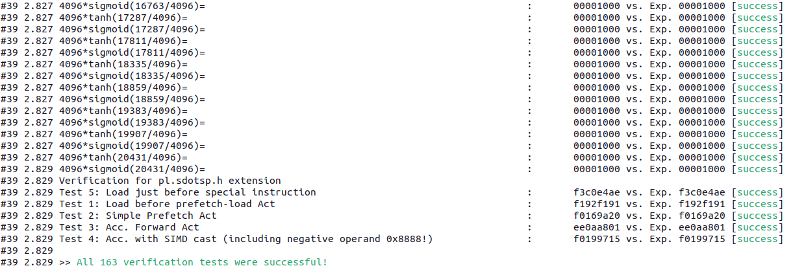

# RNNASIP Dockerfile

This directory contains a Dockerfile to build and execute the tests of the RNNASIP extension to the RI5CY core.
To build the image, execute the build script: `./build.sh`

To get a container inside the image, run `./run.sh`.

A report detailing the necessary adjustments to the getting started guide provided by the author can be found [here](./observations/README.md).

## Useful Links

- [RNNASIP Project Repository](https://github.com/andrire/RNNASIP)
- [RNNASIP Paper 1](https://ieeexplore.ieee.org/abstract/document/9218496)
- [RNNASIP Paper 2](https://ieeexplore.ieee.org/abstract/document/9481341)
- [Introduction to the RI5CY Core](https://pulp-platform.org/docs/hipeac/acaces2021/01_Intro_RISC-V.pdf)
- [GVSOC Repository](https://github.com/gvsoc/gvsoc)

## Hardware and supported ISA Specification

The RNNASIP extension was built upon the PULPissimo microcontroller architecture (single core) with a RI5CY (presently CV32E40P) core. By default, it has support for the following standard ISA extensions:

- I (integer operations, mandatory)
- M (hardware multiplication)
- C (compressed instructions aka 16 bit operations)
- F (floating point instructions and registers)

It also supports the Xpulp non-standard ISA extension, which allows for:

- hardware loops
- post-incrementing load and store instructions
- multiply-accumulate (MAC) instructions
- packed SIMD operations, such as bit manipulation and dot product

A concise presentation of the RI5CY core's capabilities can be found in the [Introduction to the RI5CY Core](https://pulp-platform.org/docs/hipeac/acaces2021/01_Intro_RISC-V.pdf).

Additionally, the authors have added three instructions:

- Sigmoid (function) instruction (`pl.tanh`)
- Hyperbolic tangent instruction (`pl.sig`)
- Load and Compute VLIW Instruction (`pl.sdotsp.h.0` and `pl.sdotsp.h.1`)

A detailed explanation of these instructions can be found in the [RNNASIP Paper 2](https://ieeexplore.ieee.org/abstract/document/9481341), section III.

## Custom Instruction Test

A test of the RNNASIP custom instructions (tanh, sigmoid and Load and Compute VLIW Instruction) is run automatically when building the container. They can be found on the following path inside the container: `/workspace/RNNASIP/sourcecode/rnnSampleCode/test.c`, or in the original repository [here](https://github.com/andrire/RNNASIP/blob/234abaa4c4924cc1d551a6f2fd91a0a557ae95e6/sourcecode/rnnSampleCode/test.c).
This test uses the default cycle-accurate simulator preconfigured by RNNASIP ([GVSOC Repository](https://github.com/gvsoc/gvsoc)), and utilizes / is built with all extensions mentioned above.

## Testing Results

All tests aimed at the added instructions by the authors passed.

