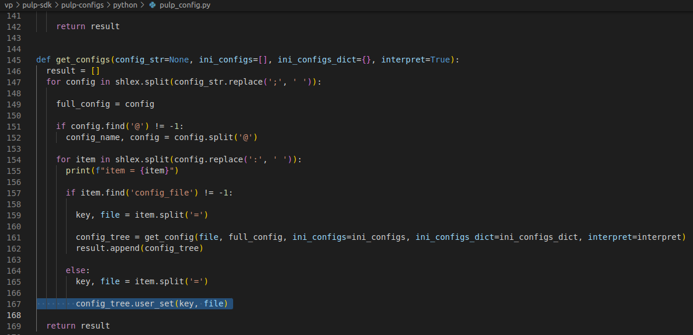

# RNNASIP Building Report

## Observations

- pulp-sdk must be cloned NOT inside vp folder (as a sibling to vp)

- python2's pip must be installed `yum install python2-pip`
- instead of `python2 -m pip install configparser` use due to migrated website `python2 -m pip install --trusted-host pypi.python.org configparser2`
- scons must be set to use python3 by editing its script at `/usr/bin/scons`

## Undocumented Pulp SDK Requirements

- Magick++ `yum install ImageMagick ImageMagick-c++-devel GraphicsMagick-c++-devel`
- Due to multiple versions of pip being used, `python3 -m pip install` and `python2 -m pip install` are preferred to pip3 or pip2  
- python3's Sphinx package `python3 -m pip install Sphinx`

## Errors

### Deprecated https link for dependency

- pmsis_api package must be corrected to have https:// on file `/workspace/RNNASIP/pulp-sdk/project.cfg`

### config_tree referenced before assignment
```
config_tree referenced before assignment in pulp-sdk/pulp-configs/python/pulp_config.py, get_configs last else
```


